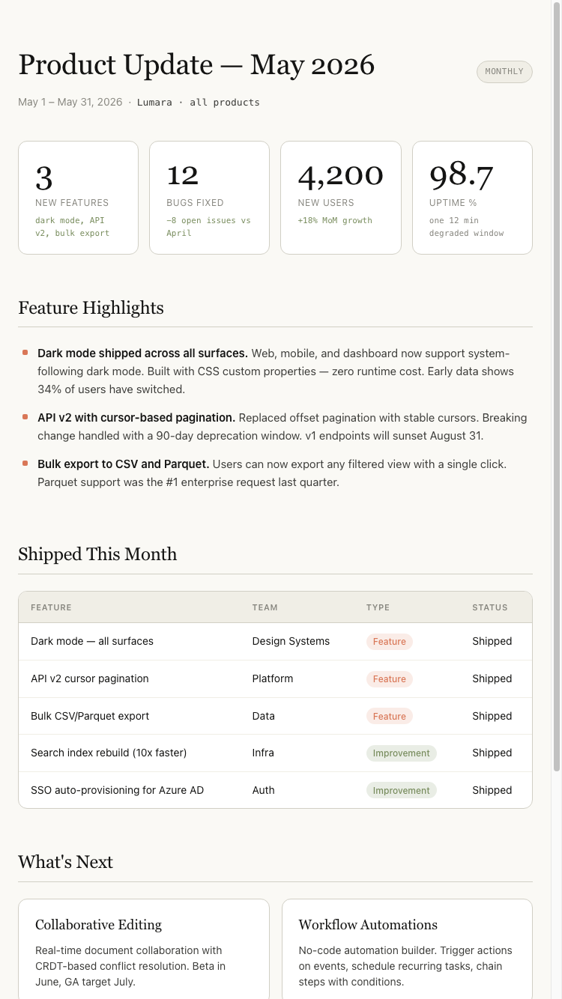
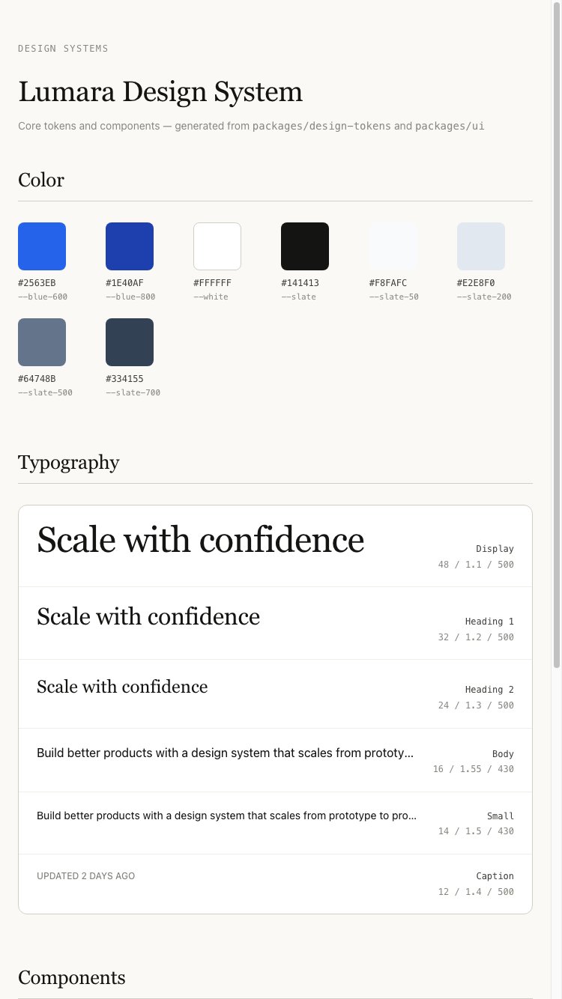
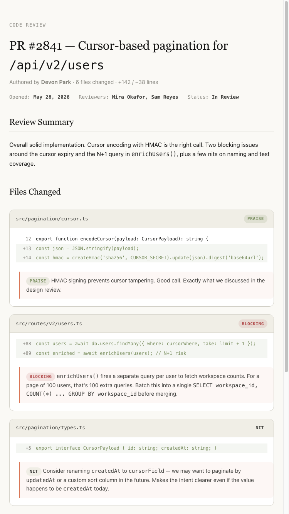
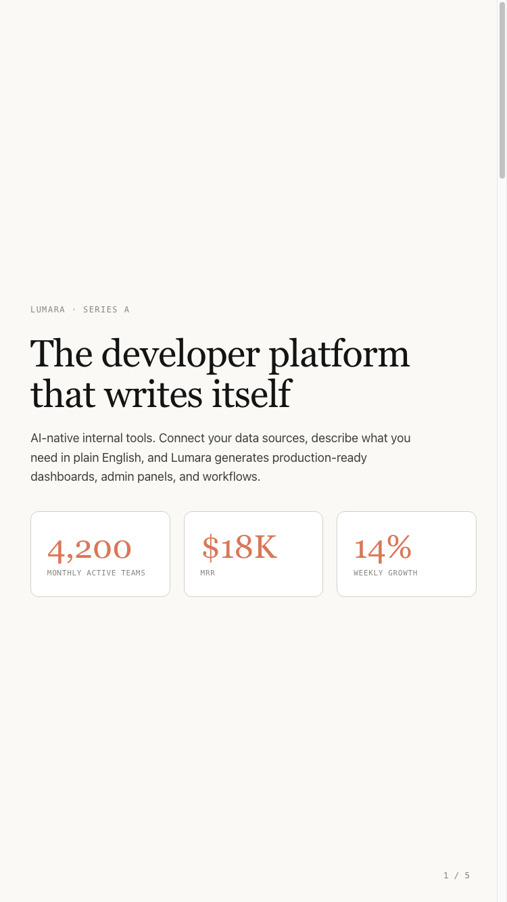
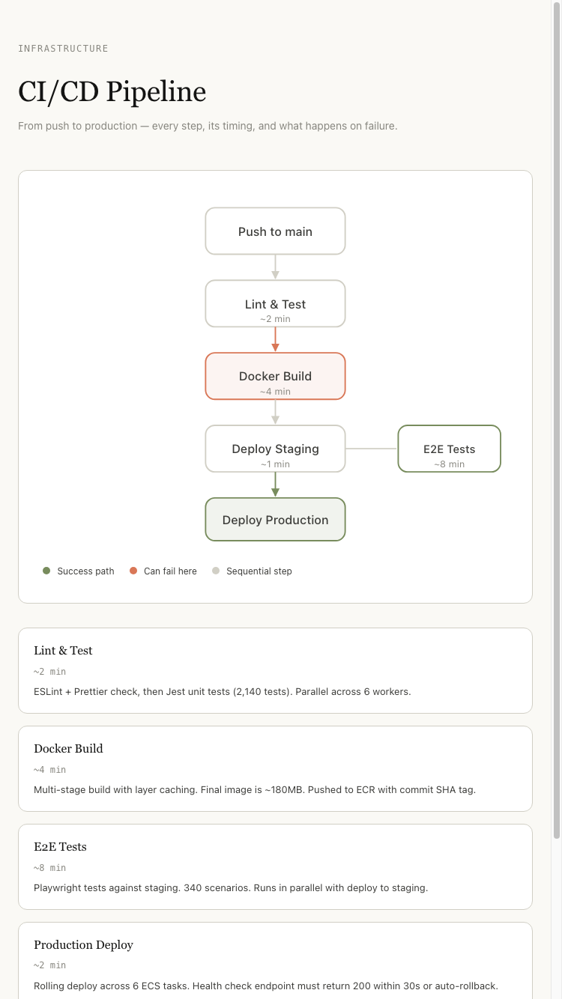
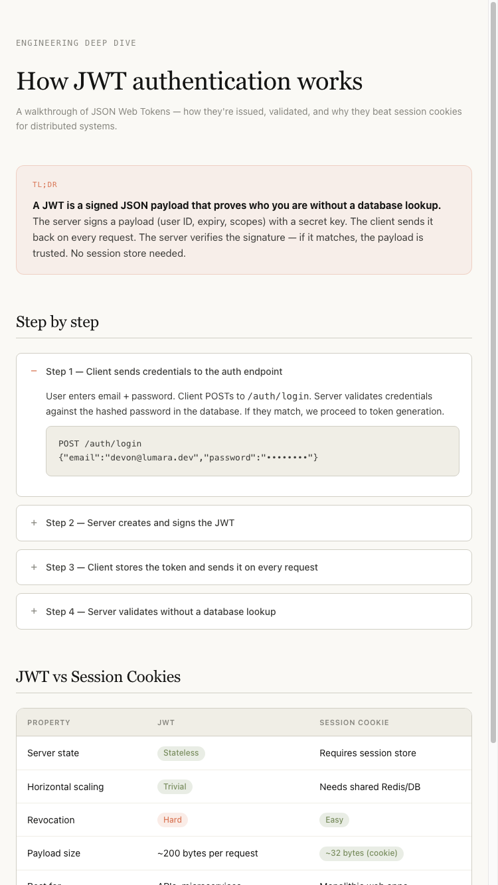
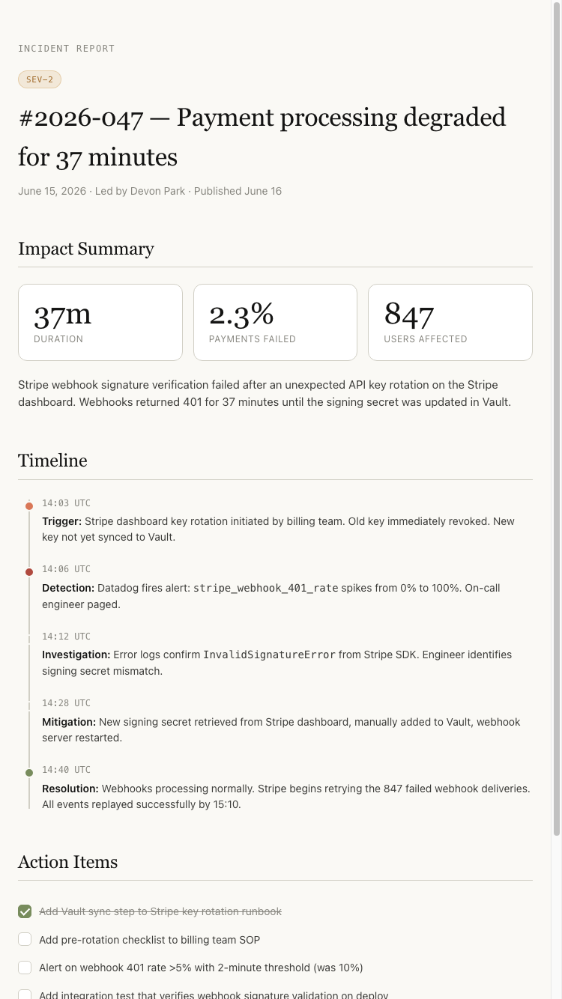
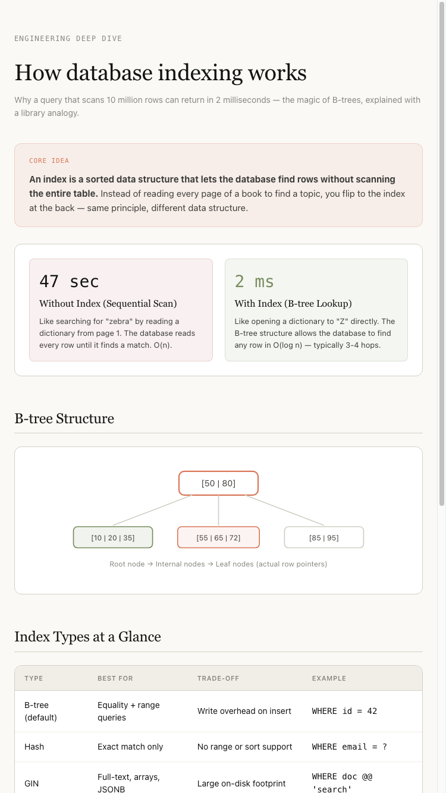
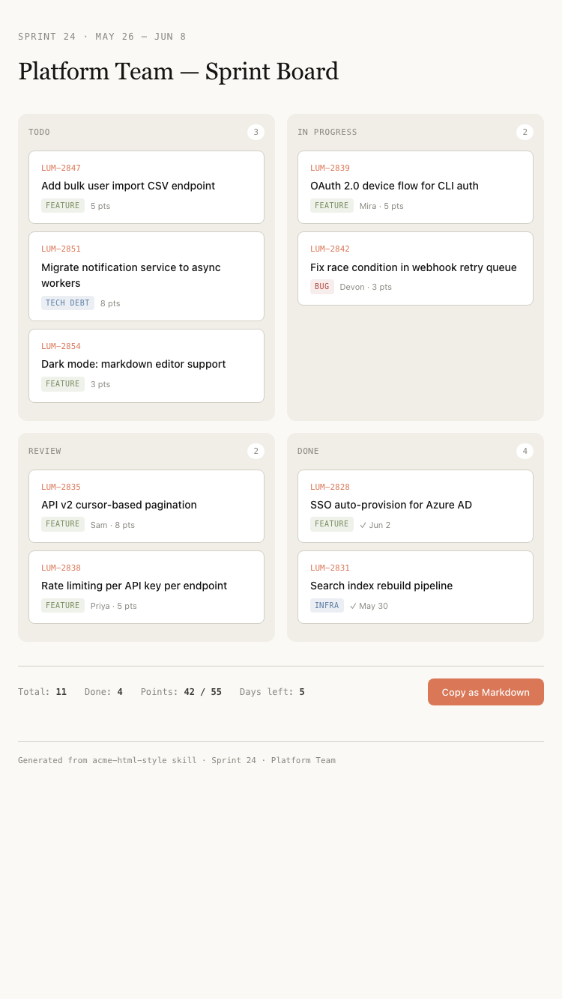
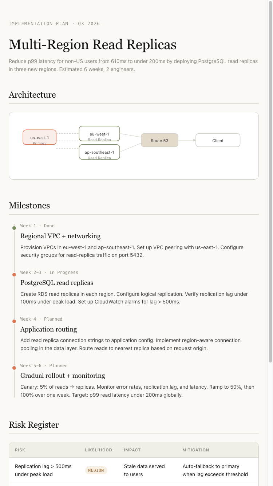

# Acme HTML Style

> [中文版本](README_zh.md)

A skill for generating self-contained HTML documents in the warm, editorial "Acme" design style from [The Unreasonable Effectiveness of HTML](https://github.com/ThariqS/html-effectiveness).

## Why this skill?

The [html-effectiveness](https://github.com/ThariqS/html-effectiveness) project showcases 21 hand-crafted HTML documents that are genuinely beautiful — warm ivory backgrounds, terracotta accents, serif headings, deliberate 1.5px borders. They feel like a well-designed print magazine translated to the browser.

LLMs can generate HTML on their own, but the output is usually generic — purple gradients, 1px borders, Inter font, the usual AI aesthetic. This skill encodes the specific design language from html-effectiveness so the agent produces documents that actually look good, consistently.

If you like this style and want your agent to generate status reports, slide decks, code reviews, flowcharts, or explainers that match it — this skill is for you.

## What it covers

9 document categories, each with composition recipes and pre-built component CSS:

| Category | Examples |
|---|---|
| Exploration & Planning | Code approach comparisons, visual design directions, implementation plans |
| Code Review & PRs | Annotated diffs, PR writeups, module maps |
| Design Systems | Color swatches, type scales, component variant sheets |
| Prototyping | Animation sandboxes, drag-and-drop demos, interaction mockups |
| Diagrams | SVG flowcharts, clickable pipeline diagrams, figure sheets |
| Slide Decks | Scroll-snap presentations with arrow-key navigation |
| Research & Learning | Feature explainers with collapsible steps, FAQ, glossary |
| Reports | Weekly status updates, incident post-mortems |
| Custom Editing UIs | Kanban boards, feature flag toggles, prompt tuners |

## Gallery

Swipe or scroll to browse examples of what this skill generates:

<div style="overflow-x: auto; white-space: nowrap; padding: 16px 0; -webkit-overflow-scrolling: touch;">
  <div style="display: flex; gap: 16px;">
    
    
    
    
    
    
    
    
    
    
  </div>
</div>

## Installation & Usage

This skill works with any AI coding agent that supports skills (Claude Code, Codex, OpenClaw, Cursor, etc.).

### Install

**Option A — From a `.skill` file**

Import `acme-html-style.skill` through your agent's skill manager or place it in your skills directory (e.g. `~/.claude/skills/`, `~/.codex/skills/`, `~/.agent/skills/`).

**Option B — From source**

```bash
git clone https://github.com/kaiychen9/acme-html-style.git
cp -r acme-html-style ~/.claude/skills/acme-html-style
```

**Option C — Install via Agent**

Ask your AI agent to install the skill directly:

> "Install the acme-html-style skill from https://github.com/kaiychen9/acme-html-style"

In Claude Code, you can also use the `/install` command or say:

> "Find and install the acme-html-style skill for generating warm editorial HTML documents"

### How it triggers

The skill activates automatically when you ask for things like:

- "Generate a weekly engineering status report"
- "Make a slide deck for the Q3 roadmap"
- "Create a flowchart of our deploy pipeline"
- "Explain how rate limiting works as an HTML page"
- "Write up an incident post-mortem"
- "Build a PR review with annotated diffs"
- "Design a feature flag management UI"

Any request that sounds like "I want an HTML document that does X" will trigger it. The skill reads your intent, picks the right patterns, and produces a self-contained `.html` file in the Acme style.

### What you get

A single `.html` file you can open directly in a browser — no build step, no dependencies. Every output follows the same warm editorial design language and can be shared, committed, or fed back into the agent for further iteration.

## Design Principles

- **No dependencies.** Every output is a single `.html` file. No npm, no CDN, no fonts, no frameworks.
- **Design tokens over hardcoded values.** Colors, fonts, spacing, shadows — all CSS variables.
- **Typography hierarchy.** Serif for headings (gravitas), sans for body (readability), mono for code/data (precision).
- **Warm palette.** Ivory page backgrounds, terracotta accents, olive for success. No bright saturated colors.
- **1.5px borders.** Deliberate. Not 1px, not 2px — 1.5px is the signature.

## License

MIT — see [LICENSE](LICENSE) for details.

## Credits

Design language extracted from [The Unreasonable Effectiveness of HTML](https://github.com/ThariqS/html-effectiveness), a collection of examples accompanying the blog post on using HTML as a flexible agent output format. All credit for the original design system goes to the html-effectiveness authors.
